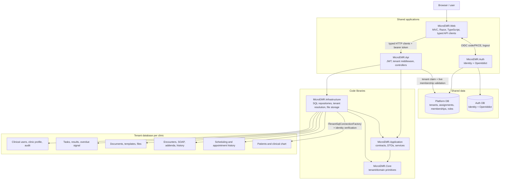

# MicroEMR current-state master diagram

The feature paths below the API are not uniform: newer endpoints commonly call application services, while several established endpoints call repository interfaces directly. Both paths ultimately use Infrastructure and tenant stored procedures.
