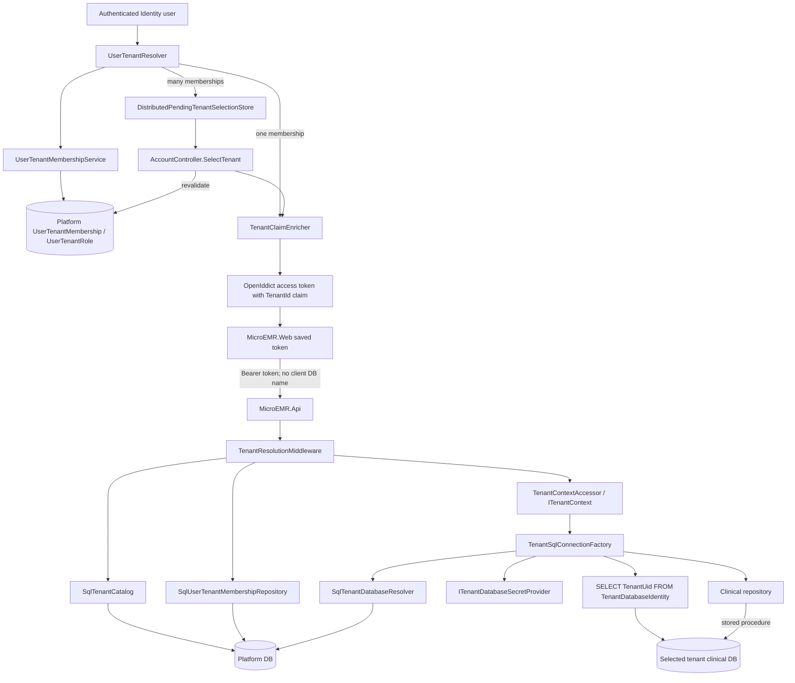

# Multi-tenant flow

## End-to-end tenant resolution

## Isolation enforcement points

1. Auth resolves only active memberships for the authenticated Identity user.
2. Selection IDs are random, short-lived, user-owned, allowed-tenant constrained, and consumed through the continuation flow.
3. Auth revalidates membership immediately before tenant claim enrichment.
4. API requires exactly one valid tenant-id claim.
5. API reloads tenant status and active membership from the platform database.
6. API replaces tenant-role claims with current membership roles.
7. Scoped tenant context is set for the request and cleared in `finally`.
8. Database metadata must belong to the context tenant and be active/complete.
9. Resolved connection string catalog must match the assigned database name.
10. Tenant database must contain exactly one matching `TenantDatabaseIdentity` row.

## Shared/platform resources

Auth/Identity/OpenIddict database; platform tenant catalog; database assignments; memberships and tenant roles; platform audit/provisioning; shared Web/API/Auth processes.

## Tenant-specific resources

Each tenant clinical database contains its own clinical users, patients and clinical/scheduling/document/configuration objects. Repositories do not accept tenant/database identifiers from browser requests.

## REVIEW POINTS

- **REVIEW POINT:** tenant-clinical isolation relies on every clinical repository using `ITenantSqlConnectionFactory`; this is a strong registered convention rather than a compiler-enforced database type.
- **REVIEW POINT:** the factory caches successful identity verification per scoped factory assignment key; connection/database metadata is still resolved on each open.
- **REVIEW POINT:** platform and Auth connection configuration are separate operational secrets, but their deployment ownership is outside source-code enforcement.

