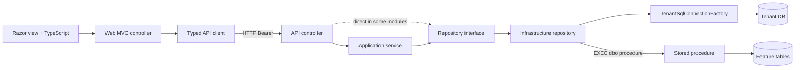
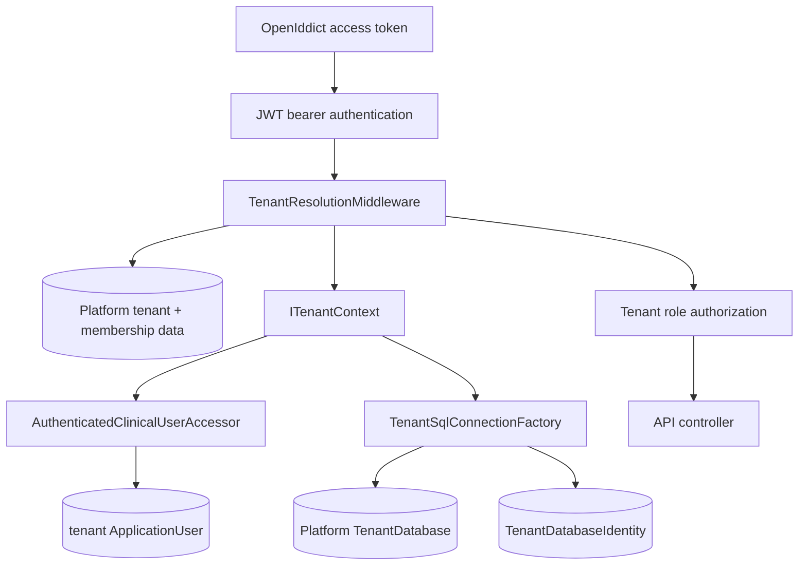
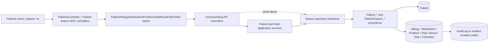
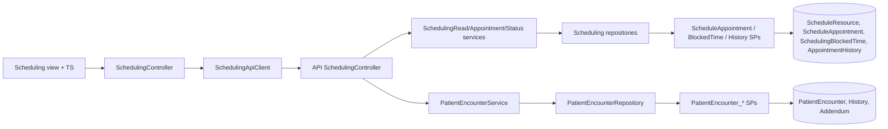
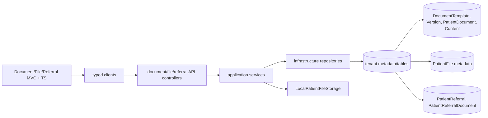

# Full application object graph

## High-level runtime graph

## Cross-cutting request graph

## Patient/chart subsystem

## Scheduling/encounter subsystem

## Document/file/referral subsystem

Relationships are expanded into stable IDs in the Visio CSV dataset.

