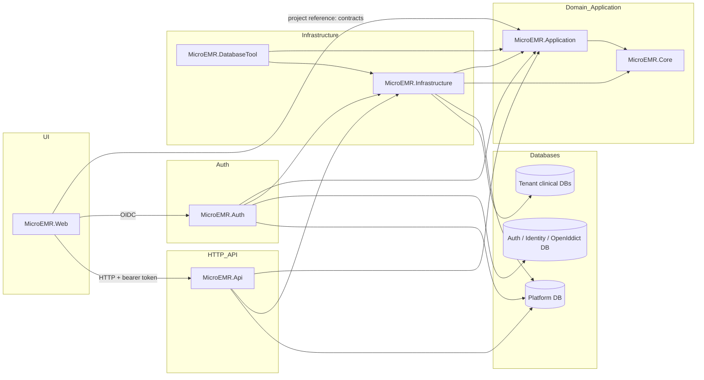

# Project dependencies

## Actual project references

| Project | References |
|---|---|
| `MicroEMR.Core` | none |
| `MicroEMR.Application` | `MicroEMR.Core` |
| `MicroEMR.Infrastructure` | `MicroEMR.Core`, `MicroEMR.Application` |
| `MicroEMR.Api` | `MicroEMR.Application`, `MicroEMR.Infrastructure` |
| `MicroEMR.Auth` | `MicroEMR.Application`, `MicroEMR.Infrastructure` |
| `MicroEMR.Web` | `MicroEMR.Application` |
| `MicroEMR.DatabaseTool` | `MicroEMR.Application`, `MicroEMR.Infrastructure` |

`MicroEMR.Web` shares application DTOs/contracts but reaches the API only over HTTP. `MicroEMR.Api` and `MicroEMR.Auth` compose Infrastructure implementations. The DatabaseTool is an administrative executable using the same tenant/platform infrastructure.

