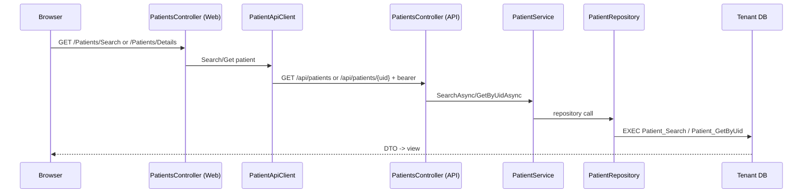

# Representative request flows

## Patient lookup/load

## Create/update patient

Patient Razor form -> `PatientsController` Web POST with antiforgery -> `PatientApiClient` -> POST `/api/patients` or PUT `/api/patients/{patientUid}` -> API `PatientsController` -> `PatientService` -> `PatientRepository` -> `Patient_Create` or `Patient_UpdateDemographics` -> `Patient` and audit data in the tenant database.

## Open patient chart

Browser -> Web `PatientsController.Details` -> `PatientApiClient.GetPatientAsync` -> API `/api/patients/{patientUid}` -> service/repository -> `Patient_GetByUid`. The Details Razor view renders the chart shell; feature TypeScript modules subsequently call Web feature controllers, which use typed clients to load allergies, medications, problems, vitals, results, tasks, alerts, files, referrals, documents, and encounters.

## Create patient document

Patient document UI -> Web `PatientDocumentsController` -> `PatientDocumentApiClient` -> POST `/api/patients/{patientUid}/documents` -> API `PatientDocumentsController` -> `PatientDocumentService` -> `PatientDocumentRepository` -> `PatientDocument_Create` -> `PatientDocument`/`PatientDocumentContent` (and template/version references when supplied) in the tenant DB.

## Create/edit encounter

Patient UI/encounter modal -> Web `PatientEncountersController` -> `PatientEncounterApiClient` -> POST `/api/patients/{patientUid}/encounters` or PUT note/SOAP routes -> API `PatientEncountersController` -> `PatientEncounterService` -> `PatientEncounterRepository` -> `PatientEncounter_Create`, `PatientEncounter_UpdateNote`, or `PatientEncounter_UpdateSoapNote` -> encounter/history/audit tables. Signing calls `PatientEncounter_Sign`; scheduling-linked signing can update appointment state through the stored procedure implementation.

## Create/edit appointment

Scheduling view -> Web `SchedulingController` (some actions initiated by page JS) -> `SchedulingApiClient` -> API `SchedulingController` -> `SchedulingAppointmentService`/status transition service -> `SchedulingAppointmentRepository` -> `ScheduleAppointment_Create`, `ScheduleAppointment_Update`, `ScheduleAppointment_Reschedule`, status/cancel/arrive procedures -> `ScheduleAppointment` and `AppointmentHistory`.

## Login

Browser -> protected Web action -> OIDC challenge -> Auth `/connect/authorize` -> Identity login (`AccountController.Login`) -> membership resolution/selection -> OpenIddict authorization code -> Web token exchange with PKCE -> Web auth cookie and saved access/refresh tokens.

## Tenant selection

`AuthorizationController` detects multiple active memberships -> stores `PendingTenantSelection` -> redirects to `AccountController.SelectTenant` -> GET lists only allowed active memberships -> POST validates antiforgery, user ownership, expiry, allowed tenant and current membership -> stores selected continuation -> resumes `/connect/authorize?tenant_continuation=...` -> consumes/revalidates continuation -> `TenantClaimEnricher` adds tenant claims -> token issuance.

## Any tenant clinical repository call

Bearer token -> API JWT validation -> `TenantResolutionMiddleware` validates tenant claim/catalog/membership and sets `ITenantContext` -> optional clinical actor resolution maps `sub` via `ApplicationUser_GetByAuthSubjectId` -> repository asks `TenantSqlConnectionFactory` -> platform `TenantDatabase_GetByTenantUid` + configured secret -> catalog name validation -> `TenantDatabaseIdentity` check -> feature stored procedure.

